Integrating genomics and multi-platform metabolomics enables metabolite
QTL detection in breeding-relevant apple germplasm
================
Emma Bilbrey
2/25/2021

**Publication Authors:** Emma A Bilbrey, Kathryn Wiliamson, Emmanuel
Hatzakis, Diane Doud Miller, Jonathan Fresnedo-Ramirez, Jessica L.
Cooperstone

To understand genotype-phytochemical associations in apple fruit, we
have developed a high-throughput integration strategy for genomic and
multi-platform metabolomics data.

**Context**: 124 apple genotypes, including members of three
pedigree-connected breeding families alongside diverse cultivars and
wild selections, were genotyped and phenotyped. Metabolite genome-wide
association studies (mGWAS) were conducted with ~10,000 single
nucleotide polymorphisms alongside phenotypic data acquired via liquid
chromatography mass spectrometry (LC-MS) and 1H nuclear magnetic
resonance (NMR) untargeted metabolomics. Putative metabolite
quantitative trait loci (mQTL) were then validated via pedigree-based
analyses (PBA).

Code in this markdown represents the first third of the work for our
publication. This third is dedicated to data visualization and prep for
mGWAS analyses. Data inputs can be found in the supplemental material
for the publication. Certain outputs from this section are then used in
the batch scripts for conducting mGWAS analyses.

Batch scripts used for mGWAS analyses are also provided in this
repository as part 2. Part 3 is the code for results processing and
visualization.

R Packages The code format here will install packages if they are not
installed then bring them into your library. If they are already
installed, they will simply be loaded into your library.

# Read in Data

Data here is read from the supplemental Excel document from our
publication. Data will be read in from pertinent sheets. Batch scripts
are found separately in the repository. Similarly, to view results from
the mGWAS genomic-metabolomic integration, please see the script in the
repository titled, “mGWAS Results Processing and Visualization”.

## Metabolomics

### LCMS (+)

In this data set, rows are samples (n=124 plus 33 pooled QCs) and
columns are metabolomic features in the format m/z\_retentiontime
(n=4,872) plus 3 rows of metadata: Genotype, Number (assigned number to
each genotype), Label (general apple
category)

``` r
PosDataQCsRaw <- read_excel("TableSupplement.xlsx", # Excel file with data
                            sheet = "Table S6 LCMS Pos Data", # sheet within the excel file with data
                            col_names = TRUE, # we want to keep the first row as column names
                            trim_ws = TRUE, # we want to trim any white space
                            na = "0") # we want all zero values to be changed to 'NA'
dim(PosDataQCsRaw)
```

    ## [1]  157 4875

``` r
head_short(PosDataQCsRaw)
```

    ## # A tibble: 5 x 5
    ##   Genotype Number Label   `235.16921223973_4.9266331… `251.16328937515_4.066669…
    ##   <chr>    <chr>  <chr>                         <dbl>                      <dbl>
    ## 1 HC       1      Pedigr…                       1483.                      2754.
    ## 2 PR       2      Diverse                       5494.                      8457.
    ## 3 W03      3      Diverse                       7170.                      6141.
    ## 4 GR       4      Pedigr…                       1311.                      2317.
    ## 5 FJ       5      Pedigr…                       1631.                      2526.

#### Address NAs

Because this data is taken from a larger set of data, some features in
this set of 124 samples may have measurements in the pooled QC but not
in the samples we are studying here. Therefore, we need to get rid of
features that have all NAs before we
impute.

``` r
# Make a vector containing the number of NAs in each column. Only count NAs from samples that are not QCs
PosNAbyColumn<-colSums(is.na(PosDataQCsRaw[which(PosDataQCsRaw$Label!="QC"),]))
# Remove columns with as many NAs as there are samples: 124 (just not hard coded as 124)
PosDrop <- names(which(PosNAbyColumn==nrow(PosDataQCsRaw[which(PosDataQCsRaw$Label != "QC"),])))
PosDataQCsRawVar <- PosDataQCsRaw[,!(names(PosDataQCsRaw) %in% PosDrop)]
dim(PosDataQCsRawVar) # compare dimensions to the previous df to see if any columns were removed
```

    ## [1]  157 4869

In the case of the Pos data, 6 columns were removed.

#### Missing Data Imputation

In LCMS (+/-), missing values for each feature are imputed with the
minimum value divided by
2.

``` r
PosDataQCsRawImputed <- PosDataQCsRawVar # getting our data frame ready for the apply function
PosDataQCsRawImputed[] <- lapply(PosDataQCsRawImputed,
                                 function(x) ifelse(is.na(x), min(x, na.rm = TRUE)/2, x))
# apply this fn to each column: If there is an NA in a column, replace it with the minimum of that column (dont use an NA as the minimum) and divide it by 2. If NA==FALSE, let it stay the same
dim(PosDataQCsRawImputed)
```

    ## [1]  157 4869

``` r
head_short(PosDataQCsRawImputed)
```

    ## # A tibble: 5 x 5
    ##   Genotype Number Label   `235.16921223973_4.9266331… `251.16328937515_4.066669…
    ##   <chr>    <chr>  <chr>                         <dbl>                      <dbl>
    ## 1 HC       1      Pedigr…                       1483.                      2754.
    ## 2 PR       2      Diverse                       5494.                      8457.
    ## 3 W03      3      Diverse                       7170.                      6141.
    ## 4 GR       4      Pedigr…                       1311.                      2317.
    ## 5 FJ       5      Pedigr…                       1631.                      2526.

### LCMS (-)

In this data set, rows are samples (n=124 plus 33 pooled QCs) and
columns are metabolomic features in the format m/z\_retentiontime
(n=4,703) plus 3 rows of metadata: Genotype, Number (assigned number to
each genotype), Label (general apple
category)

``` r
NegDataQCsRaw <- read_excel("TableSupplement.xlsx", # Excel file with data
                            sheet = "Table S7 LCMS Neg Data", # sheet within the excel file with data
                            col_names = TRUE, # we want to keep the first row as column names
                            trim_ws = TRUE, # we want to trim any white space
                            na = "0") # we want all zero values to be changed to 'NA'
dim(NegDataQCsRaw)
```

    ## [1]  157 4706

``` r
head_short(NegDataQCsRaw)
```

    ## # A tibble: 5 x 5
    ##   Genotype Number Label    `885.2037_2.98177` `525.1583_3.24969`
    ##   <chr>    <chr>  <chr>                 <dbl>              <dbl>
    ## 1 HC       1      Pedigree             30748.              2493.
    ## 2 PR       2      Diverse              89995               4259 
    ## 3 W03      3      Diverse               5650               2476 
    ## 4 GR       4      Pedigree             50965               3960 
    ## 5 FJ       5      Pedigree             35959               3962

#### Address NAs

Because this data is taken from a larger set of data, some features in
this set of 124 samples may have measurements in the pooled QC but not
in the samples we are studying here. Therefore, we need to get rid of
features that have all NAs before we
impute.

``` r
# Make a vector containing the number of NAs in each column. Only count NAs from samples that are not QCs
NegNAbyColumn <- colSums(is.na(NegDataQCsRaw[which(NegDataQCsRaw$Label!="QC"),]))
# Remove columns with as many NAs as there are samples: 124 (just not hard coded as 124)
NegDrop <- names(which(NegNAbyColumn==nrow(NegDataQCsRaw[which(NegDataQCsRaw$Label != "QC"),])))
NegDataQCsRawVar <- NegDataQCsRaw[,!(names(NegDataQCsRaw) %in% NegDrop)]
dim(NegDataQCsRawVar) # compare dimensions to the previous df to see if any columns were removed
```

    ## [1]  157 4706

In the case of the Neg data, no columns were removed.

#### Missing Data Imputation

In LCMS (+/-), missing values for each feature are imputed with the
minimum value divided by
2.

``` r
NegDataQCsRawImputed <- NegDataQCsRawVar # getting our data frame ready for the apply function
NegDataQCsRawImputed[] <- lapply(NegDataQCsRawImputed,
                                 function(x) ifelse(is.na(x), min(x, na.rm = TRUE)/2, x))
# apply this fn to each column: If there is an NA in a column, replace it with the minimum of that column (dont use an NA as the minimum) and divide it by 2. If NA==FALSE, let it stay the same
dim(NegDataQCsRawImputed)
```

    ## [1]  157 4706

``` r
head_short(NegDataQCsRawImputed)
```

    ## # A tibble: 5 x 5
    ##   Genotype Number Label    `885.2037_2.98177` `525.1583_3.24969`
    ##   <chr>    <chr>  <chr>                 <dbl>              <dbl>
    ## 1 HC       1      Pedigree             30748.              2493.
    ## 2 PR       2      Diverse              89995               4259 
    ## 3 W03      3      Diverse               5650               2476 
    ## 4 GR       4      Pedigree             50965               3960 
    ## 5 FJ       5      Pedigree             35959               3962

### NMR

In this data set, rows are samples (n=124 plus 1 pooled QC) and columns
are 0.01 ppm-wide bins (n=756) labeled by chemical shift range (ppm). It
is typical of NMR metabolomics to have a much smaller number of
metabolomic features, here, bins. NMR values were adjusted with an
affine transformation in the package mrbin, so there are no NAs that
need to be imputed. There are also 3 rows of metadata: Genotype, Number
(assigned number to each genotype), Label (general apple
category)

``` r
NMRDataQCRaw <- read_excel("TableSupplement.xlsx", # Excel file with data
                            sheet = "Table S8 1D NMR Data", # sheet within the excel file with data
                            col_names = TRUE, # we want to keep the first row as column names
                            trim_ws = TRUE, # we want to trim any white space
                            na = "0") # we want all zero values to be changed to 'NA'
dim(NMRDataQCRaw)
```

    ## [1] 125 759

``` r
head_short(NMRDataQCRaw)
```

    ## # A tibble: 5 x 5
    ##   Genotype Number Label    `9.45,9.44` `9.44,9.43`
    ##   <chr>    <chr>  <chr>          <dbl>       <dbl>
    ## 1 HC       1      Pedigree       77.3       0.935 
    ## 2 PR       2      Diverse         1.53      0.0135
    ## 3 W03      3      Diverse       366.      323.    
    ## 4 GR       4      Pedigree       86.7      64.8   
    ## 5 FJ       5      Pedigree        2.06      1.08

#### Address NAs

Because of the way the 1D NMR data was processed using the package
mrbin, there should be no NAs, even though this data is taken from a
larger data set. We will double check here, though, before
continuing.

``` r
# Make a vector containing the number of NAs in each column. Only count NAs from samples that are not the QC
NMRNAbyColumn <- colSums(is.na(NMRDataQCRaw[which(NMRDataQCRaw$Label!="QC"),]))
# Remove columns with as many NAs as there are samples: 124 (just not hard coded as 124)
NMRDrop <- names(which(NMRNAbyColumn==nrow(NMRDataQCRaw[which(NMRDataQCRaw$Label != "QC"),])))
NMRDataQCRawVar <- NMRDataQCRaw[,!(names(NMRDataQCRaw) %in% NMRDrop)]
dim(NMRDataQCRawVar) # compare dimensions to the previous df to see if any columns were removed
```

    ## [1] 125 759

In the case of the NMR data, no columns were removed, as we expected.

#### Missing Data Imputation

In NMR data there are no missing values because an affine transformation
was done to the negative values during data post processing using the R
package mrbin.

## Genomics

In this data set of genotype calls, rows are SNPs (n=11,165) and columns
are samples (n=124).

``` r
SNPData <- read_excel("TableSupplement.xlsx", # Excel file with data
                      sheet = "Table S2 mGWAS SNP Data", # sheet within the excel file with data
                      col_names = TRUE, # we want to keep the first row as column names
                      trim_ws = TRUE, # we want to trim any white space
                      na = "NA") # we want NA to be kept as NA
dim(SNPData)
```

    ## [1] 11165   128

``` r
head_short(SNPData)
```

    ## # A tibble: 5 x 5
    ##   Locus        Index Linkage_Group Genetic_Distance    HC
    ##   <chr>        <dbl>         <dbl>            <dbl> <dbl>
    ## 1 AFL2         12096            14             37.5    -1
    ## 2 CONS61        8397            10             58.3    -1
    ## 3 EV_Eve1_R422 10684            12             63.6     1
    ## 4 FEM_cg_1      8627            10             79.9     0
    ## 5 FEM_cg_10     8271            10             43.1     1

# Metabolomics Data Visualization

## Boxplots

Boxplots display each sample with raw metabolomics analysis data and
log2 transformed data

### LCMS(+)

#### Prepare Data Frame

Now we need to move the data from ‘wide’ to ‘long’ format.

``` r
PosDataQCsRawImputed_long <- PosDataQCsRawImputed %>% 
  pivot_longer(cols = `235.16921223973_4.92663319209042`:ncol(.),
               names_to = "MassRT",
               values_to = "Abundance")
head_short(PosDataQCsRawImputed_long)
```

    ## # A tibble: 5 x 5
    ##   Genotype Number Label    MassRT                            Abundance
    ##   <chr>    <chr>  <chr>    <chr>                                 <dbl>
    ## 1 HC       1      Pedigree 235.16921223973_4.92663319209042      1483.
    ## 2 HC       1      Pedigree 251.16328937515_4.06666988795521      2754.
    ## 3 HC       1      Pedigree 377.265658091383_6.4158511204482      2811.
    ## 4 HC       1      Pedigree 423.235757938656_5.1427808123249      2334.
    ## 5 HC       1      Pedigree 305.174095751415_4.55409950773556     1958.

Next, we set “Label” as a factor, so it goes in the order we specify in
“levels”. This will be important for the colors and legend in our
plots

``` r
PosDataQCsRawImputed_long$Label <- factor(PosDataQCsRawImputed_long$Label,
                                          levels = c("Diverse", "Pedigree", "Progeny", "QC"))
```

Then it is helpful to reorder the samples by their “Label” level as well
as setting “Genotype” as a factor with levels in the order we set for
“Label”

``` r
PosDataQCsRawImputed_long <- PosDataQCsRawImputed_long %>%
  arrange(Label) %>% # sort by label
  mutate(Genotype = fct_inorder(Genotype)) # set Genotype as a factor in the order we have arranged label
```

#### Raw

Now we can actually plot the boxplot with our data that is still raw but
with missing values imputed by the lowest value per feature divided by
2.

``` r
PosDataQCsRawImputed_long %>% # take this data and pipe it to the following:
  ggplot(aes(x = Genotype, # we want Genotypes on the x-axis  
             y = Abundance, # we want Feature Abundance on the y-axis
             fill = Label)) + # fill being "Label" will give us colors based on the levels of "Label"
  geom_boxplot(outlier.size = .07, # shrink outlier dot size
               lwd = .1) + # decrease line width
  scale_fill_manual(values=c("#006262","#00CECC","#B5F1EF","black")) + # manually set chosen colors
  scale_y_continuous(labels = function(x) format(x, scientific = TRUE)) + # y-axis values in sci notat.
  theme(axis.text.x=element_text(angle = 90, # turn x-axis labels to vertical
                                 hjust = 1, # move the x-axis labels just a bit
                                 size = 3), # make the apple genotype names a bit bigger
        text=element_text(family = "Calibri"), # change font of plot to Calibri
        panel.background = element_blank(), # remove the background color from the plot
        legend.key=element_blank()) + # remove the background from the legend itself
  labs(title = "LC-MS (+) Raw Feature Ion Abundances per Apple Genotype", # the main title
       subtitle = "Sorted by apple category", # This gives the subtitle
       fill = "Apple Category", # This gives the title for the legend
       x = "Apple Genotype", # This gives the title for the x-axis
       y = "Feature Ion Abundance") + # This gives the title for the y-axis
  font("title", size = 14) + # use these font() commands to change the size of the labels easily
  font("subtitle", size = 12) +
  font("xlab", size = 14) +
  font("ylab", size = 14) +
  font("legend.title", size = 12) +
  font("legend.text", size = 11)
```

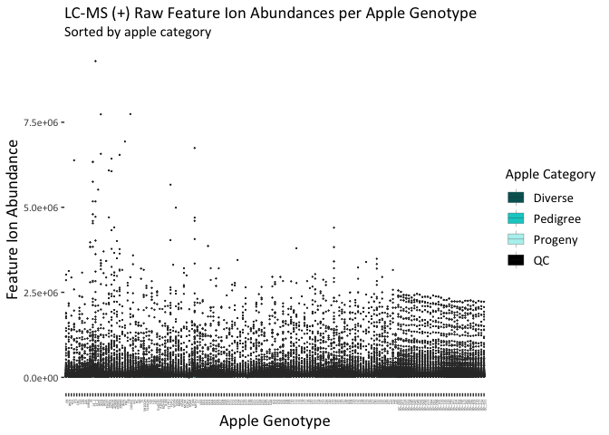<!-- -->

#### Transformed

##### Log2 Transformation

``` r
PosDataQCsLog2Imputed_long <- transmute(PosDataQCsRawImputed_long,
                                        Genotype,
                                        Number,
                                        Label,
                                        MassRT,
                                        Abundance = log2(Abundance))
head_short(PosDataQCsLog2Imputed_long)
```

    ## # A tibble: 5 x 5
    ##   Genotype Number Label   MassRT                            Abundance
    ##   <fct>    <chr>  <fct>   <chr>                                 <dbl>
    ## 1 PR       2      Diverse 235.16921223973_4.92663319209042       12.4
    ## 2 PR       2      Diverse 251.16328937515_4.06666988795521       13.0
    ## 3 PR       2      Diverse 377.265658091383_6.4158511204482       11.9
    ## 4 PR       2      Diverse 423.235757938656_5.1427808123249       11.3
    ## 5 PR       2      Diverse 305.174095751415_4.55409950773556      11.3

``` r
PosDataQCsLog2Imputed_long %>%
  ggplot(aes(x = Genotype, 
             y = Abundance,
             fill = Label)) +
  geom_boxplot(outlier.size = .07,
               lwd = .1) +
  scale_fill_manual(values=c("#006262","#00CECC","#B5F1EF","black")) +
  scale_y_continuous(trans = 'log2') + # this makes the y-axis log2 transformed as the data is
  theme(axis.text.x=element_text(angle = 90,
                                 hjust = 1,
                                 size = 3),
        text=element_text(family="Calibri"),
        panel.background = element_blank(),
        legend.key=element_blank()) +
  labs(title = "LC-MS (+) Log2-Transformed Feature Ion Abundances per Apple Genotype",
       subtitle = "Sorted by apple category",
       fill = "Apple Category",
       x = "Apple Genotype",
       y = "Feature Ion Abundance (log2)") +
  font("title", size = 14) +
  font("subtitle", size = 12) +
  font("xlab", size = 14) +
  font("ylab", size = 14) +
  font("legend.title", size = 12) +
  font("legend.text", size = 11)
```

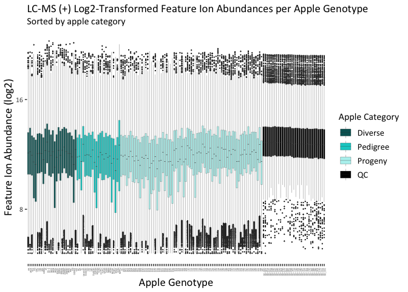<!-- -->

### LCMS(-)

#### Prepare Data Frame

Now we need to move the data from ‘wide’ to ‘long’ format.

``` r
NegDataQCsRawImputed_long <- NegDataQCsRawImputed %>% 
  pivot_longer(cols = `885.2037_2.98177`:ncol(.), # MUST change to the name of the first column
               names_to = "MassRT",
               values_to = "Abundance")
head_short(NegDataQCsRawImputed_long)
```

    ## # A tibble: 5 x 5
    ##   Genotype Number Label    MassRT            Abundance
    ##   <chr>    <chr>  <chr>    <chr>                 <dbl>
    ## 1 HC       1      Pedigree 885.2037_2.98177     30748.
    ## 2 HC       1      Pedigree 525.1583_3.24969      2493.
    ## 3 HC       1      Pedigree 569.17408_3.00042    30232.
    ## 4 HC       1      Pedigree 739.17477_2.71076    36887.
    ## 5 HC       1      Pedigree 600.12641_2.10625    27995.

Next, we set “Label” as a factor, so it goes in the order we specify in
“levels”. This will be important for the colors and legend in our
plots

``` r
NegDataQCsRawImputed_long$Label <- factor(NegDataQCsRawImputed_long$Label,
                                          levels = c("Diverse", "Pedigree", "Progeny", "QC"))
```

Then it is helpful to reorder the samples by their “Label” level as well
as setting “Genotype” as a factor with levels in the order we set for
“Label”

``` r
NegDataQCsRawImputed_long <- NegDataQCsRawImputed_long %>%
  arrange(Label) %>% # sort by label
  mutate(Genotype = fct_inorder(Genotype)) # set Genotype as a factor in the order we have arranged label
```

#### Raw

Now we can actually plot the boxplot with our data that is still raw but
with missing values imputed by the lowest value per feature divided by
2.

``` r
NegDataQCsRawImputed_long %>% # take this data and pipe it to the following:
  ggplot(aes(x = Genotype, # we want Genotypes on the x-axis  
             y = Abundance, # we want Feature Abundance on the y-axis
             fill = Label)) + # fill being "Label" will give us colors based on the levels of "Label"
  geom_boxplot(outlier.size = .07, # shrink outlier dot size
               lwd = .1) + # decrease line width
  scale_fill_manual(values=c("#7F3124","#FA6246","#FED1C9","black")) + # manually set chosen colors
  scale_y_continuous(labels = function(x) format(x, scientific = TRUE)) + # y-axis values in sci notat.
  theme(axis.text.x=element_text(angle = 90, # turn x-axis labels to vertical
                                 hjust = 1, # move the x-axis labels just a bit
                                 size = 3), # make the apple genotype names a bit bigger
        text=element_text(family = "Calibri"), # change font of plot to Calibri
        panel.background = element_blank(), # remove the background color from the plot
        legend.key=element_blank()) + # remove the background from the legend itself
  labs(title = "LC-MS (-) Raw Feature Ion Abundances per Apple Genotype", # main title
       subtitle = "Sorted by apple category", # This gives the subtitle
       fill = "Apple Category", # This gives the title for the legend
       x = "Apple Genotype", # This gives the title for the x-axis
       y = "Feature Ion Abundance") + # This gives the title for the y-axis
  font("title", size = 14) + # use these font() commands to change the size of the labels easily
  font("subtitle", size = 12) +
  font("xlab", size = 14) +
  font("ylab", size = 14) +
  font("legend.title", size = 12) +
  font("legend.text", size = 11)
```

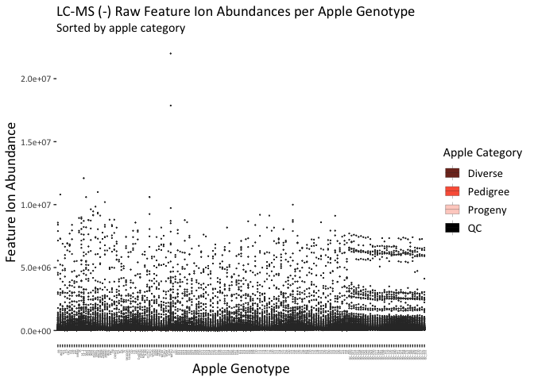<!-- -->

#### Transformed

##### Log2 Transformation

``` r
NegDataQCsLog2Imputed_long <- transmute(NegDataQCsRawImputed_long,
                                        Genotype,
                                        Number,
                                        Label,
                                        MassRT,
                                        Abundance = log2(Abundance))
head_short(NegDataQCsLog2Imputed_long)
```

    ## # A tibble: 5 x 5
    ##   Genotype Number Label   MassRT            Abundance
    ##   <fct>    <chr>  <fct>   <chr>                 <dbl>
    ## 1 PR       2      Diverse 885.2037_2.98177       16.5
    ## 2 PR       2      Diverse 525.1583_3.24969       12.1
    ## 3 PR       2      Diverse 569.17408_3.00042      16.7
    ## 4 PR       2      Diverse 739.17477_2.71076      16.9
    ## 5 PR       2      Diverse 600.12641_2.10625      14.1

``` r
NegDataQCsLog2Imputed_long %>%
  ggplot(aes(x = Genotype, 
             y = Abundance,
             fill = Label)) +
  geom_boxplot(outlier.size = .07,
               lwd = .1) +
  scale_fill_manual(values=c("#7F3124","#FA6246","#FED1C9","black")) +
  scale_y_continuous(trans = 'log2') + # this makes the y-axis log2 transformed as the data is
  theme(axis.text.x=element_text(angle = 90,
                                 hjust = 1,
                                 size = 3),
        text=element_text(family="Calibri"),
        panel.background = element_blank(),
        legend.key=element_blank()) +
  labs(title = "LC-MS (-) Log2-Transformed Feature Ion Abundances per Apple Genotype",
       subtitle = "Sorted by apple category",
       fill = "Apple Category",
       x = "Apple Genotype",
       y = "Feature Ion Abundance (log2)") +
  font("title", size = 14) +
  font("subtitle", size = 12) +
  font("xlab", size = 14) +
  font("ylab", size = 14) +
  font("legend.title", size = 12) +
  font("legend.text", size = 11)
```

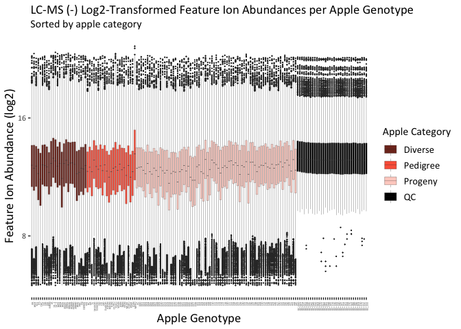<!-- -->

### NMR

#### Prepare Data Frame

Now we need to move the data from ‘wide’ to ‘long’ format.

``` r
NMRDataQCRawVar_long <- NMRDataQCRawVar %>% 
  pivot_longer(cols = `9.45,9.44`:ncol(.), # MUST change to the name of the first column
               names_to = "Bin",
               values_to = "Intensity")
head_short(NMRDataQCRawVar_long)
```

    ## # A tibble: 5 x 5
    ##   Genotype Number Label    Bin       Intensity
    ##   <chr>    <chr>  <chr>    <chr>         <dbl>
    ## 1 HC       1      Pedigree 9.45,9.44    77.3  
    ## 2 HC       1      Pedigree 9.44,9.43     0.935
    ## 3 HC       1      Pedigree 9.43,9.42    85.3  
    ## 4 HC       1      Pedigree 9.39,9.38    82.4  
    ## 5 HC       1      Pedigree 9.38,9.37   145.

Next, we set “Label” as a factor, so it goes in the order we specify in
“levels”. This will be important for the colors and legend in our
plots

``` r
NMRDataQCRawVar_long$Label <- factor(NMRDataQCRawVar_long$Label,
                                     levels = c("Diverse", "Pedigree", "Progeny", "QC"))
```

Then it is helpful to reorder the samples by their “Label” level as well
as setting “Genotype” as a factor with levels in the order we set for
“Label”

``` r
NMRDataQCRawVar_long <- NMRDataQCRawVar_long %>%
  arrange(Label) %>% # sort by label
  mutate(Genotype = fct_inorder(Genotype)) # set Genotype as a factor in the order we have arranged label
```

#### Raw

Now we can actually plot the boxplot with our data that is still raw but
with missing values imputed by the lowest value per feature divided by
2.

``` r
NMRDataQCRawVar_long %>% # take this data and pipe it to the following:
  ggplot(aes(x = Genotype, # we want Genotypes on the x-axis  
             y = Intensity, # we want Feature Intensity on the y-axis
             fill = Label)) + # fill being "Label" will give us colors based on the levels of "Label"
  geom_boxplot(outlier.size = .07, # shrink outlier dot size
               lwd = .1) + # decrease line width
  scale_fill_manual(values=c("#A18700","#FFD400","#FFF3B5","black")) + # manually set chosen colors
  scale_y_continuous(labels = function(x) format(x, scientific = TRUE)) + # y-axis values in sci notat.
  theme(axis.text.x=element_text(angle = 90, # turn x-axis labels to vertical
                                 hjust = 1, # move the x-axis labels just a bit
                                 size = 3), # make the apple genotype names a bit bigger
        text=element_text(family = "Calibri"), # change font of plot to Calibri
        panel.background = element_blank(), # remove the background color from the plot
        legend.key=element_blank()) + # remove the background from the legend itself
  labs(title = "NMR Raw Feature Bin Intensities per Apple Genotype", # This will be the main title
       subtitle = "Sorted by apple category", # This gives the subtitle
       fill = "Apple Category", # This gives the title for the legend
       x = "Apple Genotype", # This gives the title for the x-axis
       y = "Feature Bin Intensity") + # This gives the title for the y-axis
  font("title", size = 14) + # use these font() commands to change the size of the labels easily
  font("subtitle", size = 12) +
  font("xlab", size = 14) +
  font("ylab", size = 14) +
  font("legend.title", size = 12) +
  font("legend.text", size = 11)
```

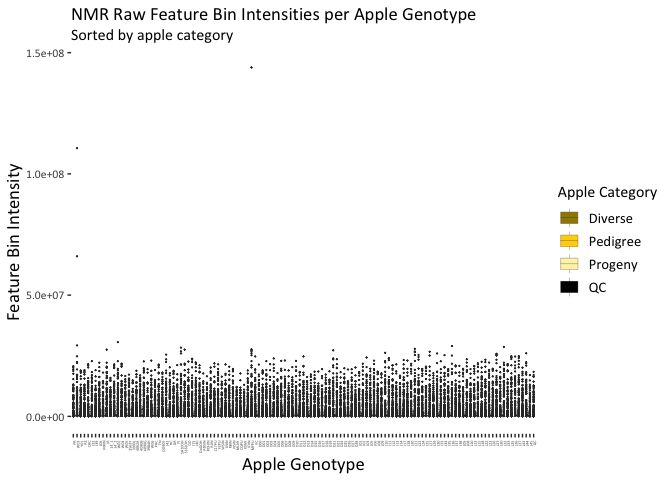<!-- -->

#### Transformed

##### Log2(x+1) Transformation

In the NMR data, some values fall between 0 and 1. These would become
negative if transformed with log2. Therefore, we will use log2(x+1) to
add one to each value before logging to keep things positive.

``` r
NMRDataQCLog2_long <- transmute(NMRDataQCRawVar_long,
                                Genotype,
                                Number,
                                Label,
                                Bin,
                                Intensity = log2(Intensity+1))
head_short(NMRDataQCLog2_long)
```

    ## # A tibble: 5 x 5
    ##   Genotype Number Label   Bin       Intensity
    ##   <fct>    <chr>  <fct>   <chr>         <dbl>
    ## 1 PR       2      Diverse 9.45,9.44    1.34  
    ## 2 PR       2      Diverse 9.44,9.43    0.0193
    ## 3 PR       2      Diverse 9.43,9.42    0.441 
    ## 4 PR       2      Diverse 9.39,9.38    6.82  
    ## 5 PR       2      Diverse 9.38,9.37    7.47

``` r
NMRDataQCLog2_long %>%
  ggplot(aes(x = Genotype, 
             y = Intensity,
             fill = Label)) +
  geom_boxplot(outlier.size = .07,
               lwd = .1) +
  scale_fill_manual(values=c("#A18700","#FFD400","#FFF3B5","black")) +
  scale_y_continuous(trans='log2', # this makes the y-axis log2 transformed as the data is
                     labels=function(x) format(x, digits=2)) + # limit number of digits of y axis
  theme(axis.text.x=element_text(angle = 90,
                                 hjust = 1,
                                 size = 3),
        text=element_text(family="Calibri"),
        panel.background = element_blank(),
        legend.key=element_blank()) +
  labs(title = "NMR Log2(x+1)-Transformed Feature Bin Intensities per Apple Genotype",
       subtitle = "Sorted by apple category",
       fill = "Apple Category",
       x = "Apple Genotype",
       y = "Feature Bin Abundance (log2(x+1))") +
  font("title", size = 14) +
  font("subtitle", size = 12) +
  font("xlab", size = 14) +
  font("ylab", size = 14) +
  font("legend.title", size = 12) +
  font("legend.text", size = 11)
```

<!-- -->

## PCA

Principal components analyses

### Prepare Data

Now we need to move the data from ‘long’ to ‘wide’ format.

``` r
PosDataQCsLog2Imputed_wide <- PosDataQCsLog2Imputed_long %>% 
  pivot_wider(names_from = "MassRT",
              values_from = "Abundance")
head_short(PosDataQCsLog2Imputed_wide)
```

    ## # A tibble: 5 x 5
    ##   Genotype Number Label   `235.16921223973_4.9266331… `251.16328937515_4.066669…
    ##   <fct>    <chr>  <fct>                         <dbl>                      <dbl>
    ## 1 PR       2      Diverse                       12.4                        13.0
    ## 2 W03      3      Diverse                       12.8                        12.6
    ## 3 Y01      7      Diverse                       10.8                        11.2
    ## 4 RS       11     Diverse                        9.77                       11.9
    ## 5 CHC      12     Diverse                        9.65                       11.3

``` r
NegDataQCsLog2Imputed_wide <- NegDataQCsLog2Imputed_long %>% 
  pivot_wider(names_from = "MassRT",
              values_from = "Abundance")
head_short(NegDataQCsLog2Imputed_wide)
```

    ## # A tibble: 5 x 5
    ##   Genotype Number Label   `885.2037_2.98177` `525.1583_3.24969`
    ##   <fct>    <chr>  <fct>                <dbl>              <dbl>
    ## 1 PR       2      Diverse               16.5               12.1
    ## 2 W03      3      Diverse               12.5               11.3
    ## 3 Y01      7      Diverse               14.9               11.6
    ## 4 RS       11     Diverse               14.2               11.1
    ## 5 CHC      12     Diverse               13.5               11.7

``` r
NMRDataQCLog2_wide <- NMRDataQCLog2_long %>% 
  pivot_wider(names_from = "Bin",
              values_from = "Intensity")
head_short(NMRDataQCLog2_wide)
```

    ## # A tibble: 5 x 5
    ##   Genotype Number Label   `9.45,9.44` `9.44,9.43`
    ##   <fct>    <chr>  <fct>         <dbl>       <dbl>
    ## 1 PR       2      Diverse       1.34       0.0193
    ## 2 W03      3      Diverse       8.52       8.34  
    ## 3 Y01      7      Diverse       5.32       7.92  
    ## 4 RS       11     Diverse       0.438      0.192 
    ## 5 CHC      12     Diverse       1.50       0.545

Next, we set “Label” as a factor, so it goes in the order we specify in
“levels”. This will be important for the colors and legend in our
plots

``` r
PosQCLabel <- factor(PosDataQCsLog2Imputed_wide$Label,
                   levels = c("Diverse", "Pedigree", "Progeny", "QC"))
```

``` r
NegQCLabel <- factor(NegDataQCsLog2Imputed_wide$Label,
                   levels = c("Diverse", "Pedigree", "Progeny", "QC"))
```

Because we will not be doing a PCA with pooled QCs for NMR data, we do
not need to make a factor called NMRQCLabel.

### With Pooled QCs

PCAs including pooled QCs are helpful for LCMS data sets to show
consistency of data quality over long LCMS runs that have the potential
to vary over time due to instrumental variability. Tight clustering of
poooled QCs indicates good consistency of data quality in our
experiments.

#### LCMS(+)

Centering and Scaling make it so that features that are more abundant
are not seen as more important in the
PCA.

``` r
pcaPosQC = prcomp(PosDataQCsLog2Imputed_wide[,-c(1:3)], # we dont want to include metadata
                  center=TRUE, # features are shifted to be zero centered
                  scale=TRUE) # features are scaled to have unit variance
```

Extract the output from the prcomp() function that will actually be
graphed (PC1 and 2)

``` r
pcaPosQCX <- as.data.frame(pcaPosQC$x)
```

``` r
ggplot(data=pcaPosQCX,
       aes(x=PC1,
           y=PC2,
           color=PosQCLabel,
           shape=PosQCLabel,
           fill=PosQCLabel)) +
  geom_point(size=2) +
  scale_color_manual(values=c("#006262","#00CECC", "#006262","black")) + # The dot outline color
  scale_fill_manual(values=c("#006262","#00CECC", "#B5F1EF","black")) + # The dot fill color
  scale_shape_manual(values=c(21,22,24,23)) + # specific shapes assigned to the categories
  labs(title="LC-MS (+) PCA Scores Plot",
       subtitle="All Apple Extracts and Pooled QCs",
       color="Apple Category",
       fill="Apple Category",
       shape="Apple Category") +
  xlab(paste0("PC1: ",
              round(summary(pcaPosQC)$importance[2,"PC1"]*100, digits=2),
              "%")) +
  ylab(paste0("PC2: ",
              round(summary(pcaPosQC)$importance[2,"PC2"]*100, digits=2),
              "%")) +
  theme_bw() +
  theme(panel.grid=element_blank(),
        text=element_text(family="Calibri")) +
  font("title", size = 14) +
  font("subtitle", size = 12) +
  font("xlab", size = 14) +
  font("ylab", size = 14) +
  font("xy.text", size = 12) +
  font("legend.title", size = 14) +
  font("legend.text", size = 12)
```

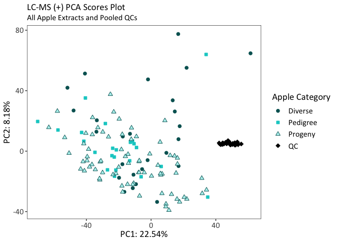<!-- -->

#### LCMS(-)

Centering and Scaling make it so that features that are more abundant
are not seen as more important in the
PCA.

``` r
pcaNegQC = prcomp(NegDataQCsLog2Imputed_wide[,-c(1:3)], # we dont want to include metadata
                  center=TRUE, # features are shifted to be zero centered
                  scale=TRUE) # features are scaled to have unit variance
```

Extract the output from the prcomp() function that will actually be
graphed (PC1 and 2)

``` r
pcaNegQCX <- as.data.frame(pcaNegQC$x)
```

``` r
ggplot(data=pcaNegQCX,
       aes(x=PC1,
           y=PC2,
           color=NegQCLabel,
           shape=NegQCLabel,
           fill=NegQCLabel)) +
  geom_point(size=2) +
  scale_color_manual(values=c("#7F3124","#FA6246","#7F3124","black")) + # The dot outline color
  scale_fill_manual(values=c("#7F3124","#FA6246","#FED1C9","black")) + # The dot fill color
  scale_shape_manual(values=c(21,22,24,23)) + # specific shapes assigned to the categories
  labs(title="LC-MS (-) PCA Scores Plot",
       subtitle="All Apple Extracts and Pooled QCs",
       color="Apple Category",
       fill="Apple Category",
       shape="Apple Category") +
  xlab(paste0("PC1: ",
              round(summary(pcaNegQC)$importance[2,"PC1"]*100, digits=2),
              "%")) +
  ylab(paste0("PC2: ",
              round(summary(pcaNegQC)$importance[2,"PC2"]*100, digits=2),
              "%")) +
  theme_bw() +
  theme(panel.grid=element_blank(),
        text=element_text(family="Calibri")) +
  font("title", size = 14) +
  font("subtitle", size = 12) +
  font("xlab", size = 14) +
  font("ylab", size = 14) +
  font("xy.text", size = 12) +
  font("legend.title", size = 14) +
  font("legend.text", size = 12)
```

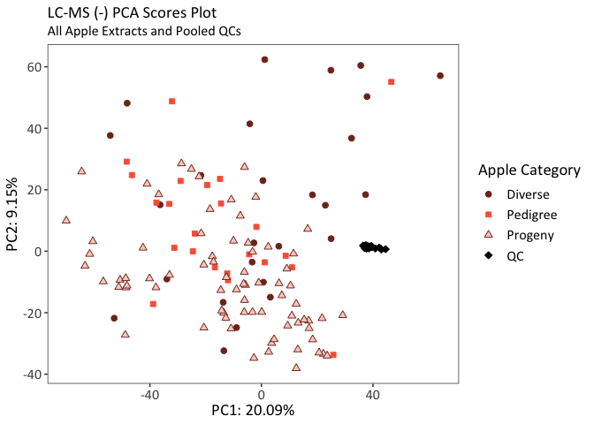<!-- -->

### Regular

To assess metabolomic variability across apple extracts, PCA was also
performed without pooled QCs

#### Remove Pooled QCs

``` r
PosDataLog2Imputed_wide <- PosDataQCsLog2Imputed_wide %>%
  filter(Label != "QC") # We want to remove the rows of QC samples
dim(PosDataLog2Imputed_wide) # the number of rows should now be 124 (without the 33 QCs)
```

    ## [1]  124 4869

``` r
NegDataLog2Imputed_wide <- NegDataQCsLog2Imputed_wide %>%
  filter(Label != "QC") # We want to remove the rows of QC samples
dim(NegDataLog2Imputed_wide) # the number of rows should now be 124 (without the 33 QCs)
```

    ## [1]  124 4706

``` r
NMRDataLog2_wide <- NMRDataQCLog2_wide %>%
  filter(Label != "QC") # We want to remove the row with the QC sample
dim(NMRDataLog2_wide) # the number of rows should now be 124 (without the 1 QC)
```

    ## [1] 124 759

Next, we set “Label” as a factor, so it goes in the order we specify in
“levels”. This will be important for the colors and legend in our
plots

``` r
PosLabel <- factor(PosDataLog2Imputed_wide$Label,
                   levels = c("Diverse", "Pedigree", "Progeny"))
```

``` r
NegLabel <- factor(NegDataLog2Imputed_wide$Label,
                   levels = c("Diverse", "Pedigree", "Progeny"))
```

``` r
NMRLabel <- factor(NMRDataLog2_wide$Label,
                   levels = c("Diverse", "Pedigree", "Progeny"))
```

#### LCMS(+)

Centering and Scaling make it so that features that are more abundant
are not seen as more important in the
PCA.

``` r
pcaPos = prcomp(PosDataLog2Imputed_wide[,-c(1:3)], # we dont want to include metadata
                  center=TRUE, # features are shifted to be zero centered
                  scale=TRUE) # features are scaled to have unit variance
```

Extract the output from the prcomp() function that will actually be
graphed (PC1 and 2)

``` r
pcaPosX <- as.data.frame(pcaPos$x)
```

``` r
ggplot(data=pcaPosX,
       aes(x=PC1,
           y=PC2,
           color=PosLabel,
           shape=PosLabel,
           fill=PosLabel)) +
  geom_point(size=2) +
  scale_color_manual(values=c("#006262","#00CECC","#006262")) + # The dot outline color
  scale_fill_manual(values=c("#006262","#00CECC","#B5F1EF")) + # The dot fill color
  scale_shape_manual(values=c(21,22,24)) + # specific shapes assigned to the categories
  labs(title="LC-MS (+) PCA Scores Plot",
       subtitle="All Apple Extracts",
       color="Apple Category",
       fill="Apple Category",
       shape="Apple Category") +
  xlab(paste0("PC1: ",
              round(summary(pcaPos)$importance[2,"PC1"]*100, digits=2),
              "%")) +
  ylab(paste0("PC2: ",
              round(summary(pcaPos)$importance[2,"PC2"]*100, digits=2),
              "%")) +
  theme_bw() +
  theme(panel.grid=element_blank(),
        text=element_text(family="Calibri")) +
  font("title", size = 14) +
  font("subtitle", size = 12) +
  font("xlab", size = 14) +
  font("ylab", size = 14) +
  font("xy.text", size = 12) +
  font("legend.title", size = 14) +
  font("legend.text", size = 12)
```

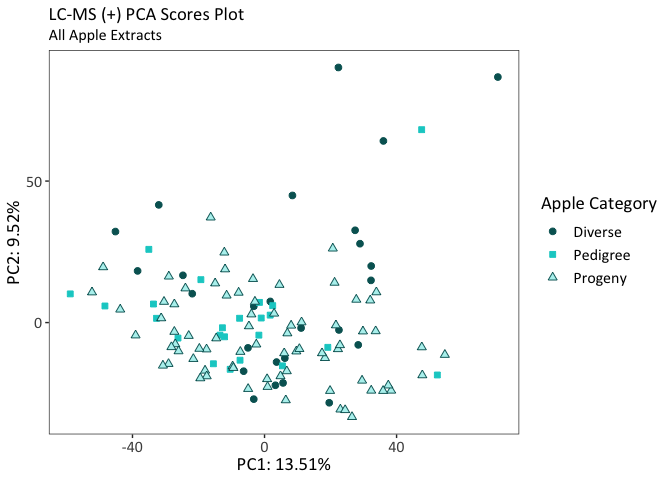<!-- -->

#### LCMS(-)

Centering and Scaling make it so that features that are more abundant
are not seen as more important in the
PCA.

``` r
pcaNeg <- prcomp(NegDataLog2Imputed_wide[,-c(1:3)], # we dont want to include metadata
                 center=TRUE, # features are shifted to be zero centered
                 scale=TRUE) # features are scaled to have unit variance
```

Extract the output from the prcomp() function that will actually be
graphed (PC1 and 2)

``` r
pcaNegX <- as.data.frame(pcaNeg$x)
```

``` r
ggplot(data=pcaNegX,
       aes(x=PC1,
           y=PC2,
           color=NegLabel,
           shape=NegLabel,
           fill=NegLabel)) +
  geom_point(size=2) +
  scale_color_manual(values=c("#7F3124","#FA6246","#7F3124")) + # The dot outline color
  scale_fill_manual(values=c("#7F3124","#FA6246","#FED1C9")) + # The dot fill color
  scale_shape_manual(values=c(21,22,24)) + # specific shapes assigned to the categories
  labs(title="LC-MS (-) PCA Scores Plot",
       subtitle="All Apple Extracts",
       color="Apple Category",
       fill="Apple Category",
       shape="Apple Category") +
  xlab(paste0("PC1: ",
              round(summary(pcaNeg)$importance[2,"PC1"]*100, digits=2),
              "%")) +
  ylab(paste0("PC2: ",
              round(summary(pcaNeg)$importance[2,"PC2"]*100, digits=2),
              "%")) +
  theme_bw() +
  theme(panel.grid=element_blank(),
        text=element_text(family="Calibri")) +
  font("title", size = 14) +
  font("subtitle", size = 12) +
  font("xlab", size = 14) +
  font("ylab", size = 14) +
  font("xy.text", size = 12) +
  font("legend.title", size = 14) +
  font("legend.text", size = 12)
```

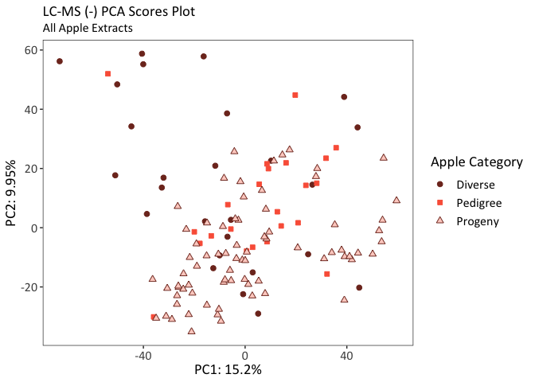<!-- -->
\#\#\#\# NMR Centering and Scaling make it so that features that are
more abundant are not seen as more important in the
PCA.

``` r
pcaNMR <- prcomp(NMRDataLog2_wide[,-c(1:3)], # we dont want to include metadata
                 center=TRUE, # features are shifted to be zero centered
                 scale=TRUE) # features are scaled to have unit variance
```

Extract the output from the prcomp() function that will actually be
graphed (PC1 and 2)

``` r
pcaNMRX <- as.data.frame(pcaNMR$x)
```

``` r
ggplot(data=pcaNMRX,
       aes(x=PC1,
           y=PC2,
           color=NMRLabel,
           shape=NMRLabel,
           fill=NMRLabel)) +
  geom_point(size=2) +
  scale_color_manual(values=c("#A18700","#FFD400","#A18700")) + # The dot outline color
  scale_fill_manual(values=c("#A18700","#FFD400","#FFF3B5")) + # The dot fill color
  scale_shape_manual(values=c(21,22,24)) + # specific shapes assigned to the categories
  labs(title="NMR PCA Scores Plot",
       subtitle="All Apple Extracts",
       color="Apple Category",
       fill="Apple Category",
       shape="Apple Category") +
  xlab(paste0("PC1: ",
              round(summary(pcaNMR)$importance[2,"PC1"]*100, digits=2),
              "%")) +
  ylab(paste0("PC2: ",
              round(summary(pcaNMR)$importance[2,"PC2"]*100, digits=2),
              "%")) +
  theme_bw() +
  theme(panel.grid=element_blank(),
        text=element_text(family="Calibri")) +
  font("title", size = 14) +
  font("subtitle", size = 12) +
  font("xlab", size = 14) +
  font("ylab", size = 14) +
  font("xy.text", size = 12) +
  font("legend.title", size = 14) +
  font("legend.text", size = 12)
```

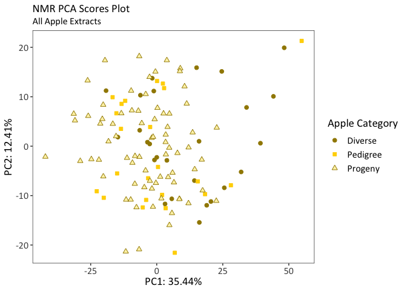<!-- -->

# Data Prep for mGWAS

## Metabolomics

### Divide into Population Subsets

3 nested population subsets of the apple genotypes (Progeny: n=75,
Pedigree=98, Diverse=124) were used to conduct 3 complementary sets of
mGWAS per metabolomics platform. This approach enables us to utilize
pedigree-related apples and other diverse, wild selections to capture
mQTL that were stable across a wide range of apple germplasm. For
imputation in the Progeny and Pedigree subsets, we are not just imputing
with the entire 124 then subsetting the data. We are taking the
original, non-imputed, untransformed data and running the imputation and
log2 transformation in the batch scripts prior to running the mGWAS
scripts. Therefore, this section will employ the original raw data from
above.

#### LCMS(+)

##### Diverse

For Diverse, we want all the apples (n=124), except the pooled QCs, so
this is the same as the data frame we prepared at first by filtering out
the metabolites with zero variance, we just need select all the samples
we want (aka all but the QCs)

``` r
PosDiverseRaw4mGWAS <- PosDataQCsRawVar %>%
  filter(Label %in% c("Diverse", "Pedigree", "Progeny")) # we want to keep the rows with these 3 Labels
head_short(PosDiverseRaw4mGWAS)
```

    ## # A tibble: 5 x 5
    ##   Genotype Number Label   `235.16921223973_4.9266331… `251.16328937515_4.066669…
    ##   <chr>    <chr>  <chr>                         <dbl>                      <dbl>
    ## 1 HC       1      Pedigr…                       1483.                      2754.
    ## 2 PR       2      Diverse                       5494.                      8457.
    ## 3 W03      3      Diverse                       7170.                      6141.
    ## 4 GR       4      Pedigr…                       1311.                      2317.
    ## 5 FJ       5      Pedigr…                       1631.                      2526.

``` r
dim(PosDiverseRaw4mGWAS)
```

    ## [1]  124 4869

##### Pedigree

For pedigree, we want those labeled as “Pedigree” & “Progeny” ( not
“Diverse”)

``` r
PosPedigreeRaw4mGWAS <- PosDataQCsRawVar %>%
  filter(Label %in% c("Pedigree","Progeny"))
head_short(PosPedigreeRaw4mGWAS)
```

    ## # A tibble: 5 x 5
    ##   Genotype Number Label   `235.16921223973_4.9266331… `251.16328937515_4.066669…
    ##   <chr>    <chr>  <chr>                         <dbl>                      <dbl>
    ## 1 HC       1      Pedigr…                       1483.                      2754.
    ## 2 GR       4      Pedigr…                       1311.                      2317.
    ## 3 FJ       5      Pedigr…                       1631.                      2526.
    ## 4 SH10OH   6      Pedigr…                       3762.                      3822.
    ## 5 S16LOH   8      Pedigr…                       1121.                      2779.

``` r
dim(PosPedigreeRaw4mGWAS)
```

    ## [1]   98 4869

##### Progeny

``` r
PosProgenyRaw4mGWAS <- PosDataQCsRawVar %>%
  filter(Label == "Progeny")
head_short(PosProgenyRaw4mGWAS)
```

    ## # A tibble: 5 x 5
    ##   Genotype Number Label   `235.16921223973_4.9266331… `251.16328937515_4.066669…
    ##   <chr>    <chr>  <chr>                         <dbl>                      <dbl>
    ## 1 EC       9      Progeny                       2515.                      3322.
    ## 2 D00      13     Progeny                       3941.                      3985.
    ## 3 D01      14     Progeny                       3241.                      3022.
    ## 4 D02      15     Progeny                       1765.                      2674.
    ## 5 D03      16     Progeny                       2214.                      2264.

``` r
dim(PosProgenyRaw4mGWAS)
```

    ## [1]   75 4869

#### LCMS(-)

##### Diverse

For Diverse, we want all the apples (n=124), except the pooled QCs, so
this is the same as the data frame we prepared at first by filtering out
the metabolites with zero variance, we just need select all the samples
we want (aka all but the QCs)

``` r
NegDiverseRaw4mGWAS <- NegDataQCsRawVar %>%
  filter(Label %in% c("Diverse", "Pedigree", "Progeny")) # we want to keep the rows with these 3 Labels
head_short(NegDiverseRaw4mGWAS)
```

    ## # A tibble: 5 x 5
    ##   Genotype Number Label    `885.2037_2.98177` `525.1583_3.24969`
    ##   <chr>    <chr>  <chr>                 <dbl>              <dbl>
    ## 1 HC       1      Pedigree             30748.              2493.
    ## 2 PR       2      Diverse              89995               4259 
    ## 3 W03      3      Diverse               5650               2476 
    ## 4 GR       4      Pedigree             50965               3960 
    ## 5 FJ       5      Pedigree             35959               3962

``` r
dim(NegDiverseRaw4mGWAS)
```

    ## [1]  124 4706

##### Pedigree

For pedigree, we want those labeled as “Pedigree” & “Progeny” ( not
“Diverse”)

``` r
NegPedigreeRaw4mGWAS <- NegDataQCsRawVar %>%
  filter(Label %in% c("Pedigree","Progeny"))
head_short(NegPedigreeRaw4mGWAS)
```

    ## # A tibble: 5 x 5
    ##   Genotype Number Label    `885.2037_2.98177` `525.1583_3.24969`
    ##   <chr>    <chr>  <chr>                 <dbl>              <dbl>
    ## 1 HC       1      Pedigree             30748.              2493.
    ## 2 GR       4      Pedigree             50965               3960 
    ## 3 FJ       5      Pedigree             35959               3962 
    ## 4 SH10OH   6      Pedigree             70495               7607 
    ## 5 S16LOH   8      Pedigree             34106               2444

``` r
dim(NegPedigreeRaw4mGWAS)
```

    ## [1]   98 4706

##### Progeny

``` r
NegProgenyRaw4mGWAS <- NegDataQCsRawVar %>%
  filter(Label == "Progeny")
head_short(NegProgenyRaw4mGWAS)
```

    ## # A tibble: 5 x 5
    ##   Genotype Number Label   `885.2037_2.98177` `525.1583_3.24969`
    ##   <chr>    <chr>  <chr>                <dbl>              <dbl>
    ## 1 EC       9      Progeny             48917.              3311.
    ## 2 D00      13     Progeny             30532               4756 
    ## 3 D01      14     Progeny             32918.              3752.
    ## 4 D02      15     Progeny             30995               2884.
    ## 5 D03      16     Progeny             20247               3182

``` r
dim(NegProgenyRaw4mGWAS)
```

    ## [1]   75 4706

#### NMR

##### Diverse

For Diverse, we want all the apples (n=124), except the pooled QC, so
this is the same as the data frame we prepared at first by filtering out
the metabolites with zero variance, we just need select all the samples
we want (aka all but the QCs)

``` r
NMRDiverseRaw4mGWAS <- NMRDataQCRawVar %>%
  filter(Label %in% c("Diverse", "Pedigree", "Progeny")) # we want to keep the rows with these 3 Labels
head_short(NMRDiverseRaw4mGWAS)
```

    ## # A tibble: 5 x 5
    ##   Genotype Number Label    `9.45,9.44` `9.44,9.43`
    ##   <chr>    <chr>  <chr>          <dbl>       <dbl>
    ## 1 HC       1      Pedigree       77.3       0.935 
    ## 2 PR       2      Diverse         1.53      0.0135
    ## 3 W03      3      Diverse       366.      323.    
    ## 4 GR       4      Pedigree       86.7      64.8   
    ## 5 FJ       5      Pedigree        2.06      1.08

``` r
dim(NMRDiverseRaw4mGWAS)
```

    ## [1] 124 759

##### Pedigree

For pedigree, we want those labeled as “Pedigree” & “Progeny” ( not
“Diverse”)

``` r
NMRPedigreeRaw4mGWAS <- NMRDataQCRawVar %>%
  filter(Label %in% c("Pedigree","Progeny"))
head_short(NMRPedigreeRaw4mGWAS)
```

    ## # A tibble: 5 x 5
    ##   Genotype Number Label    `9.45,9.44` `9.44,9.43`
    ##   <chr>    <chr>  <chr>          <dbl>       <dbl>
    ## 1 HC       1      Pedigree       77.3        0.935
    ## 2 GR       4      Pedigree       86.7       64.8  
    ## 3 FJ       5      Pedigree        2.06       1.08 
    ## 4 SH10OH   6      Pedigree      108.       102.   
    ## 5 S16LOH   8      Pedigree      150.       645.

``` r
dim(NMRPedigreeRaw4mGWAS)
```

    ## [1]  98 759

##### Progeny

``` r
NMRProgenyRaw4mGWAS <- NMRDataQCRawVar %>%
  filter(Label == "Progeny")
head_short(NMRProgenyRaw4mGWAS)
```

    ## # A tibble: 5 x 5
    ##   Genotype Number Label   `9.45,9.44` `9.44,9.43`
    ##   <chr>    <chr>  <chr>         <dbl>       <dbl>
    ## 1 EC       9      Progeny      128.          123.
    ## 2 D00      13     Progeny      202.          125.
    ## 3 D01      14     Progeny       26.4         400.
    ## 4 D02      15     Progeny       62.4         131.
    ## 5 D03      16     Progeny        1.60        160.

``` r
dim(NMRProgenyRaw4mGWAS)
```

    ## [1]  75 759

## Genomics

### Divide into Population Subsets

SNP data also had to be divided into the population subsets described
above. It is a bit more difficult because there is no information in the
SNP data fram that tells us which apple genotypes are in the 3
categories (Diverse, Pedigree, Progeny). Therefore, we must keep only
the columns with the names we desire for each of the three sets.

#### Diverse

Diverse includes all samples, so this should be the same as the data we
read in above. We will rename to make things clear and parallel with the
other population sets.

``` r
SNPDataDiverse <- SNPData
```

#### Pedigree

We can take the 4 columns of metadata and bind them to the SNP data for
the samples that are a part of the
Pedigree

``` r
SNPDataPedigree <- cbind(SNPData[,1:4],SNPData[,colnames(SNPData) %in% PosPedigreeRaw4mGWAS$Genotype])
head_short(SNPDataPedigree)
```

    ##          Locus Index Linkage_Group Genetic_Distance HC
    ## 1         AFL2 12096            14           37.487 -1
    ## 2       CONS61  8397            10           58.315 -1
    ## 3 EV_Eve1_R422 10684            12           63.647  1
    ## 4     FEM_cg_1  8627            10           79.901  0
    ## 5    FEM_cg_10  8271            10           43.148  1

``` r
dim(SNPDataPedigree) # The number of columns should be the metadata + samples (4+98)
```

    ## [1] 11165   102

#### Progeny

We can take the 4 columns of metadata and bind them to the SNP data for
the samples that are a part of the Progeny
set

``` r
SNPDataProgeny <- cbind(SNPData[,1:4],SNPData[,colnames(SNPData) %in% PosProgenyRaw4mGWAS$Genotype])
head_short(SNPDataProgeny)
```

    ##          Locus Index Linkage_Group Genetic_Distance EC
    ## 1         AFL2 12096            14           37.487 -1
    ## 2       CONS61  8397            10           58.315  0
    ## 3 EV_Eve1_R422 10684            12           63.647  1
    ## 4     FEM_cg_1  8627            10           79.901  1
    ## 5    FEM_cg_10  8271            10           43.148  0

``` r
dim(SNPDataProgeny) # The number of columns should be the metadata + samples (4+75)
```

    ## [1] 11165    79

### Model Parameterization

Due to the high-throughput nature of integrating metabolomics data with
genomic data, an mGWAS model could not be parameterized separately for
each metabolomic feature. Therefore, general practices were adopted in
order to model known relationships as well as structure that could be
taken into account by including principal components.

#### SNP PCA Plots

A PCA of SNP data was conducted for each of the population subsets. The
scree plot acted as an “elbow plot” in order to indicate the number of
principal components that characterized the majority of the variation
within each subset.

##### Diverse

###### Address NAs

NAs are acceptable for the mGWAS. We have a threshold for missing data.
However, we will need them to be imputed in determining the number of
principal components to use in the mGWAS model below in the section DATA
PREP FOR
mGWAS.

``` r
SNPDataDiverseImputed <- impute.knn(as.matrix(SNPDataDiverse[,5:ncol(SNPDataDiverse)]))$data # 5 is the first line that isn't metadata
head_short(SNPDataDiverseImputed)
```

###### Remove SNPs with No Variance

SNPs with no variance will be of no use in the PCA, so we must remove
them.

``` r
length(which(apply(SNPDataDiverseImputed, 1, var)==0)) # gives the number of SNPs with variance of 0
```

    ## [1] 1

``` r
which(apply(SNPDataDiverseImputed, 1, var)==0) # gives the row number of the SNP with variance of 0
```

    ## [1] 2768

``` r
SNPDataDiverseImputedVar <-SNPDataDiverseImputed[-which(apply(SNPDataDiverseImputed, 1, var)==0),] # removes the SNP
dim(SNPDataDiverseImputedVar)
```

    ## [1] 11164   124

We see that there is 1 SNP that has a variance of 0 after imputation.

###### PCA Scores Plot

``` r
pcaSNPDiverse = prcomp(t(SNPDataDiverseImputedVar), 
                       center=TRUE, 
                       scale=FALSE)
```

``` r
pcaSNPDiverseX <- as.data.frame(pcaSNPDiverse$x)
dim(pcaSNPDiverseX) # this should be the number of samples in columns and rows (124)
```

    ## [1] 124 124

``` r
ggplot(data = pcaSNPDiverseX,
       aes(x = PC1,
           y = PC2)) +
  geom_point() +
  labs(title="SNPs PCA Scores Plot - Diverse",
       subtitle="All Apple Genotypes") +
  xlab(paste0("PC1: ",
              round(summary(pcaSNPDiverse)$importance[2,"PC1"]*100, digits=2),
              "%")) +
  ylab(paste0("PC2: ",
              round(summary(pcaSNPDiverse)$importance[2,"PC2"]*100, digits=2),
              "%")) +
  theme_bw() +
  theme(text=element_text(family="Calibri"),
        panel.background = element_blank(),
        panel.grid = element_blank()) +
  font("title", size = 14) +
  font("subtitle", size = 12) +
  font("xlab", size = 14) +
  font("ylab", size = 14) +
  font("xy.text", size = 12)
```

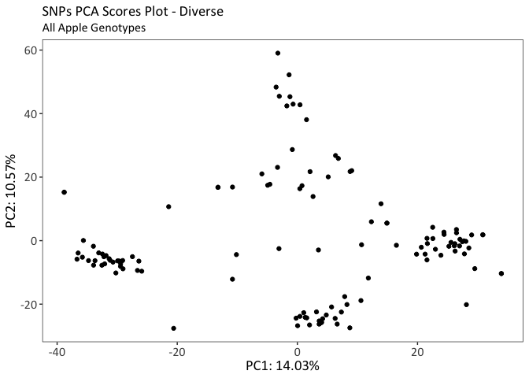<!-- -->

###### PCA Scree Plot

Do some math to get ready to plot the scree plot

``` r
stdevDiverse <- pcaSNPDiverse$sdev # extract standard deviation
prvarDiverse <- stdevDiverse^2 # square the standard deviation
propvarexDiverse <- prvarDiverse/sum(prvarDiverse)
dfpvxDiverse <- as.data.frame(propvarexDiverse) # make it into a dataframe
```

``` r
ggplot(dfpvxDiverse,
       aes(x=1:124, # we just want the x-axis to be 1 through the number of samples we have (124)
           y=propvarexDiverse)) + # the y axis will be the prop. of variance explained for each PC
  geom_line(linetype = "dashed", # the dots will be connected by a dashed line
            colour="grey25") +  # the line will be grey
  geom_point() + # the data will be plotted on the graph as points
  geom_point(aes(x = 10, # After graphing, go back and choose the point that you want to be the elbow
                 y=propvarexDiverse[10]), # in this case, the 10th
             colour="red2") + # make it red
  scale_y_continuous(labels = scales::percent) + # make the y axis in percent
  labs(title="SNPs PCA Scree Plot - Diverse",
       subtitle = "All Apple Genotypes") +
  xlab("Principal Component") +
  ylab("Percent Variance Explained") +
  theme_bw() +
  theme(text=element_text(family="Calibri"),
        panel.background = element_blank(),
        panel.grid = element_blank()) +
  font("title", size = 14) +
  font("subtitle", size = 12) +
  font("xlab", size = 14) +
  font("ylab", size = 14) +
  font("xy.text", size = 12)
```

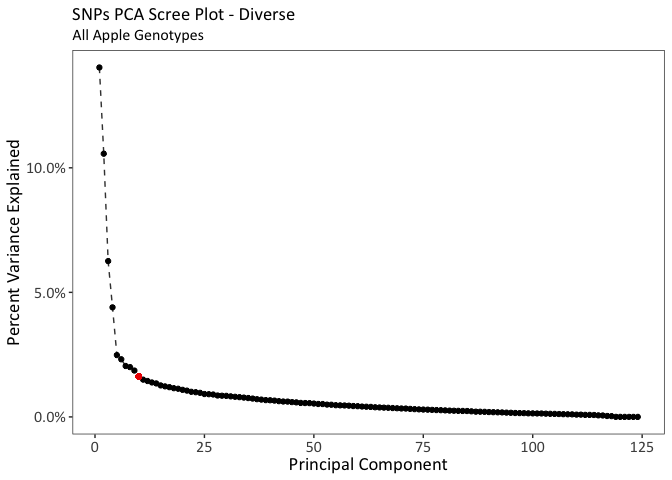<!-- -->

##### Pedigree

###### Address NAs

NAs are acceptable for the mGWAS. We have a threshold for missing data.
However, we will need them to be imputed in determining the number of
principal components to use in the mGWAS model below in the section DATA
PREP FOR
mGWAS.

``` r
SNPDataPedigreeImputed <- impute.knn(as.matrix(SNPDataPedigree[,5:ncol(SNPDataPedigree)]))$data # 5 is the first line that isn't metadata
head_short(SNPDataPedigreeImputed)
```

###### Remove SNPs with No Variance

SNPs with no variance will be of no use in the PCA, so we must remove
them.

``` r
length(which(apply(SNPDataPedigreeImputed, 1, var)==0)) # gives the number of SNPs with variance of 0
```

    ## [1] 102

``` r
head(which(apply(SNPDataPedigreeImputed, 1, var)==0)) # gives first few row numbers of SNPs w/ variance of 0
```

    ## [1] 593 619 819 830 890 895

``` r
SNPDataPedigreeImputedVar <-SNPDataPedigreeImputed[-which(apply(SNPDataPedigreeImputed, 1, var)==0),] # removes the SNPs with variance of 0
dim(SNPDataPedigreeImputedVar)
```

    ## [1] 11063    98

We see that there are 102 SNPs that have a variance of 0 after
imputation.

###### PCA Scores Plot

``` r
pcaSNPPedigree = prcomp(t(SNPDataPedigreeImputedVar),
                        center=TRUE,
                        scale=FALSE)
```

``` r
pcaSNPPedigreeX <- as.data.frame(pcaSNPPedigree$x)
```

``` r
ggplot(data = pcaSNPPedigreeX,
       aes(x = PC1,
           y = PC2)) +
  geom_point() +
  labs(title="SNPs PCA Scores Plot - Pedigree",
       subtitle="Apple Genotypes in Pedigree-Connected Families") +
  xlab(paste0("PC1: ",
              round(summary(pcaSNPPedigree)$importance[2,"PC1"]*100, digits=2),
              "%")) +
  ylab(paste0("PC2: ",
              round(summary(pcaSNPPedigree)$importance[2,"PC2"]*100, digits=2),
              "%")) +
  theme_bw() +
  theme(text=element_text(family="Calibri"),
        panel.background = element_blank(),
        panel.grid = element_blank()) +
  font("title", size = 14) +
  font("subtitle", size = 12) +
  font("xlab", size = 14) +
  font("ylab", size = 14) +
  font("xy.text", size = 12)
```

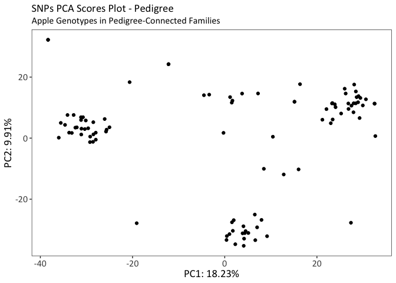<!-- -->

###### PCA Scree Plot

Do some math to get ready to plot the scree plot

``` r
stdevPedigree <- pcaSNPPedigree$sdev # extract standard deviation
prvarPedigree <- stdevPedigree^2 # square the standard deviation
propvarexPedigree <- prvarPedigree/sum(prvarPedigree)
dfpvxPedigree <- as.data.frame(propvarexPedigree) # make it into a dataframe
```

``` r
ggplot(dfpvxPedigree,
       aes(x=1:98, # we just want the x-axis to be 1 through the number of samples we have (98)
           y=propvarexPedigree)) + # the y axis will be the prop. of variance explained for each PC
  geom_line(linetype = "dashed", # the dots will be connected by a dashed line
            colour="grey25") +  # the line will be grey
  geom_point() + # the data will be plotted on the graph as points
  geom_point(aes(x = 6, # After graphing, go back and choose the point that you want to be the elbow
                 y=propvarexPedigree[6]), # in this case, the 6th
             colour="red2") + # make it red
  scale_y_continuous(labels = scales::percent) + # make the y axis in percent
  labs(title="SNPs PCA Scree Plot - Pedigree",
       subtitle = "Apple Genotypes in Pedigree-Connected Families") +
  xlab("Principal Component") +
  ylab("Percent Variance Explained") +
  theme_bw() +
  theme(text=element_text(family="Calibri"),
        panel.background = element_blank(),
        panel.grid = element_blank()) +
  font("title", size = 14) +
  font("subtitle", size = 12) +
  font("xlab", size = 14) +
  font("ylab", size = 14) +
  font("xy.text", size = 12)
```

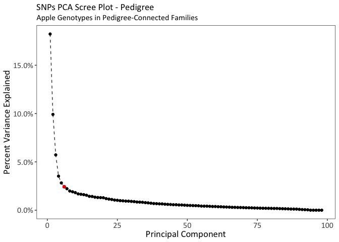<!-- -->
\#\#\#\#\# Progeny

###### Address NAs

NAs are acceptable for the mGWAS. We have a threshold for missing data.
However, we will need them to be imputed in determining the number of
principal components to use in the mGWAS model below in the section DATA
PREP FOR
mGWAS.

``` r
SNPDataProgenyImputed <- impute.knn(as.matrix(SNPDataProgeny[,5:ncol(SNPDataProgeny)]))$data # 5 is the first line that isn't metadata;
head_short(SNPDataProgenyImputed)
```

###### Remove SNPs with No Variance

SNPs with no variance will be of no use in the PCA, so we must remove
them.

``` r
length(which(apply(SNPDataProgenyImputed, 1, var)==0)) # gives the number of SNPs with variance of 0
```

    ## [1] 1371

``` r
head(which(apply(SNPDataProgenyImputed, 1, var)==0)) # gives the first few row numbers of the SNPs with variance of 0
```

    ## [1]  1 25 29 46 59 88

``` r
SNPDataProgenyImputedVar <-SNPDataProgenyImputed[-which(apply(SNPDataProgenyImputed, 1, var)==0),] # removes the SNPs with variance of 0
dim(SNPDataProgenyImputedVar)
```

    ## [1] 9794   75

We see that there are 1371 SNPs that have a variance of 0 after
imputation.

###### PCA Scores Plot

``` r
pcaSNPProgeny = prcomp(t(SNPDataProgenyImputedVar),
                        center=TRUE,
                        scale=FALSE)
```

``` r
pcaSNPProgenyX <- as.data.frame(pcaSNPProgeny$x)
dim(pcaSNPProgenyX)
```

    ## [1] 75 75

``` r
ggplot(data = pcaSNPProgenyX,
       aes(x = PC1,
           y = PC2)) +
  geom_point() +
  labs(title="SNPs PCA Scores Plot - Progeny",
       subtitle="Progenies Apple Genotypes") +
  xlab(paste0("PC1: ",
              round(summary(pcaSNPProgeny)$importance[2,"PC1"]*100, digits=2),
              "%")) +
  ylab(paste0("PC2: ",
              round(summary(pcaSNPProgeny)$importance[2,"PC2"]*100, digits=2),
              "%")) +
  theme_bw() +
  theme(text=element_text(family="Calibri"),
        panel.background = element_blank(),
        panel.grid = element_blank()) +
  font("title", size = 14) +
  font("subtitle", size = 12) +
  font("xlab", size = 14) +
  font("ylab", size = 14) +
  font("xy.text", size = 12)
```

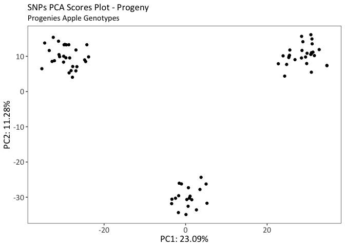<!-- -->

###### PCA Scree Plot

Do some math to get ready to plot the scree plot

``` r
stdevProgeny <- pcaSNPProgeny$sdev # extract standard deviation
prvarProgeny <- stdevProgeny^2 # square the standard deviation
propvarexProgeny <- prvarProgeny/sum(prvarProgeny)
dfpvxProgeny <- as.data.frame(propvarexProgeny) # make it into a dataframe
```

``` r
ggplot(dfpvxProgeny,
       aes(x=1:75, # we just want the x-axis to be 1 through the number of samples we have (75)
           y=propvarexProgeny)) + # the y axis will be the prop. of variance explained for each PC
  geom_line(linetype = "dashed", # the dots will be connected by a dashed line
            colour="grey25") +  # the line will be grey
  geom_point() + # the data will be plotted on the graph as points
  geom_point(aes(x = 3, # After graphing, go back and choose the point that you want to be the elbow
                 y=propvarexProgeny[3]), # in this case, the 3rd
             colour="red2") + # make it red
  scale_y_continuous(labels = scales::percent) + # make the y axis in percent
  labs(title="SNPs PCA Scree Plot - Progeny",
       subtitle = "Progenies Apple Genotypes") +
  xlab("Principal Component") +
  ylab("Percent Variance Explained") +
  theme_bw() +
  theme(text=element_text(family="Calibri"),
        panel.background = element_blank(),
        panel.grid = element_blank()) +
  font("title", size = 14) +
  font("subtitle", size = 12) +
  font("xlab", size = 14) +
  font("ylab", size = 14) +
  font("xy.text", size = 12)
```

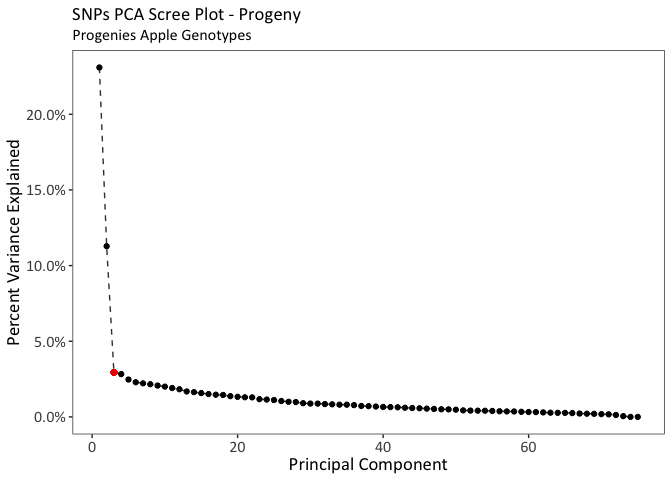<!-- -->

#### AGHmatrix Kinship Matrix

The package AGHmatrix was used to construct an H matrix: a relationship
matrix based on an additive relationship matrix (A), corrected by
genetic information (G).

##### A Matrix

In this section, we will calculate the additive relationship matrix.
These calculations require a parentage file that consists of 3 Columns.
Column 1:Individual, Column 2: Parent 1, Column 3: Parent 2 (parent
order does not matter). Some individuals in the list are those that I do
not have both SNP and metabolomic data for but they are helpful in
tracking parentage through the apple genotypes. 0’s represent an unknown
parent.

``` r
Parentage4Amat <- as.data.frame(read_excel("TableSupplement.xlsx", # Excel file with data
                                           sheet = "Table S11 Parentage for Amat",
                                           col_names = TRUE,
                                           trim_ws = TRUE))
dim(Parentage4Amat)
```

    ## [1] 138   3

``` r
head(Parentage4Amat) # we dont need to use head_short() bc there are only 3 columns
```

    ##      Ind  Par1   Par2
    ## 1     HC  KSNY MN1627
    ## 2     PR     0      0
    ## 3    W03     0      0
    ## 4     GR    GD  C17PU
    ## 5     FJ RDSIN   RJIN
    ## 6 SH10OH    GR   CQPU

``` r
Amat <- Amatrix(Parentage4Amat,ploidy=2)
head_short(Amat)
```

##### G Matrix

In this section, we will calculate the genetic relationship matrix.
These calculations require SNP data that is in the 0,1,2 format with
missing data coded as NA. Some individuals in the list are those that I
do not have both SNP and metabolomic data for but they are helpful in
tracking parentage through the apple genotypes. 0’s represent an unknown
parent. 2 genotypes are included that have SNP data but no metabolomics
data. Pedigree individuals used in Amat that dont have SNPs are not
included
here.

``` r
SNPs4Gmat <- data.frame(read_excel("TableSupplement.xlsx", # Excel file with data
                                   sheet = "Table S12 SNPs for Gmat",
                                   col_names = TRUE,
                                   trim_ws = TRUE,
                                   na = "NA"),
                        row.names = 1)

dim(SNPs4Gmat)
```

    ## [1]   126 11165

``` r
head_short(SNPs4Gmat)
```

    ##     AFL2 CONS61 EV_Eve1_R422 FEM_cg_1 FEM_cg_10
    ## HC     0      0            2        1         2
    ## PR    NA      1            0        1         0
    ## W03    0      0            1        2         2
    ## GR     0      1            1        2         1
    ## FJ     0      2            1        2         1

``` r
Gmat <- Gmatrix(SNPmatrix = as.matrix(SNPs4Gmat),
                missingValue = NA,
                maf=0.05,
                method = "VanRaden")
```

    ## Initial data: 
    ##  Number of Individuals: 126 
    ##  Number of Markers: 11165 
    ## 
    ## Missing data check: 
    ##  Total SNPs: 11165 
    ##   0 SNPs dropped due to missing data threshold of 1 
    ##  Total of: 11165  SNPs 
    ## MAF check: 
    ##   820 SNPs dropped with MAF below 0.05 
    ##  Total: 10345  SNPs 
    ## Monomorphic check: 
    ##  No monomorphic SNPs 
    ## Summary check: 
    ##  Initial:  11165 SNPs 
    ##  Final:  10345  SNPs ( 820  SNPs removed) 
    ##  
    ## Completed! Time = 3.258  seconds

``` r
head_short(Gmat)
```

    ##             HC           PR         W03          GR           FJ
    ## HC   0.7456927 -0.128920947 -0.14356125 -0.25023071 -0.306223611
    ## PR  -0.1289209  0.999561131  0.08653656 -0.05203814 -0.009001988
    ## W03 -0.1435613  0.086536557  1.22692254 -0.05540962 -0.049412610
    ## GR  -0.2502307 -0.052038139 -0.05540962  0.75823051 -0.213510669
    ## FJ  -0.3062236 -0.009001988 -0.04941261 -0.21351067  0.999090642

##### H Matrix

Gives relationship between individuals based on pedigree (Amat) and
corrected by molecular information (Gmat)

Calculate the matrix:

``` r
Hmat <- Hmatrix(A=Amat,
                G=Gmat,
                markers=SNPmatrix,
                method="Martini",
                ploidy=2,
                missingValue=NA,
                maf=0.05)
head_short(Hmat)
```

Then re-format the matrix so that the apple genotypes are in the order
we require:

``` r
HmatRev <- Rev(Hmat,
               margin=c(1,2)) # this means both rows (1) and columns (2) will be reversed
head_short(HmatRev)
```

    ##             HC           PR         W03          GR           FJ
    ## HC   0.7459428 -0.128941868 -0.14356679 -0.25067343 -0.305919149
    ## PR  -0.1289786  0.999607784  0.08656524 -0.05190834 -0.009136919
    ## W03 -0.1435742  0.086564016  1.22696581 -0.05518164 -0.049733681
    ## GR  -0.2503340 -0.052040692 -0.05530246  0.75853824 -0.213846792
    ## FJ  -0.3065827 -0.009037165 -0.04962891 -0.21319674  0.999218534

Next, we need to remove extra individuals that were included to help
show the relationships between the genotypes but are those that we do
not have phenotypic data for. We know that the first 124 rows & first
124 columns are the ones that are in our true data set, therefore we
will remove 125 to the end for both rows and columns.

``` r
HmatSub <- HmatRev[-c(125:nrow(HmatRev)),-c(125:ncol(HmatRev))]
dim(HmatSub)
```

    ## [1] 124 124

``` r
head_short(HmatSub)
```

    ##             HC           PR         W03          GR           FJ
    ## HC   0.7459428 -0.128941868 -0.14356679 -0.25067343 -0.305919149
    ## PR  -0.1289786  0.999607784  0.08656524 -0.05190834 -0.009136919
    ## W03 -0.1435742  0.086564016  1.22696581 -0.05518164 -0.049733681
    ## GR  -0.2503340 -0.052040692 -0.05530246  0.75853824 -0.213846792
    ## FJ  -0.3065827 -0.009037165 -0.04962891 -0.21319674  0.999218534

##### Divide into Population Sets

###### Diverse

This will be all 124 that is in the Hmat now. We will just rename to
keep things
consistent

``` r
HmatDiverse <- HmatSub
```

###### Pedigree

``` r
HmatPedigree <- HmatSub[rownames(HmatSub) %in% PosPedigreeRaw4mGWAS$Genotype,
                        colnames(HmatSub) %in% PosPedigreeRaw4mGWAS$Genotype]
head_short(HmatPedigree)
```

    ##                  HC         GR         FJ     SH10OH      S16LOH
    ## HC      0.745942824 -0.2506734 -0.3059191 -0.2813913  0.00150015
    ## GR     -0.250334012  0.7585382 -0.2138468  0.3649945 -0.24952846
    ## FJ     -0.306582685 -0.2131967  0.9992185 -0.2028022 -0.16852967
    ## SH10OH -0.280915009  0.3648143 -0.2031552  0.9287229 -0.21979417
    ## S16LOH  0.001570234 -0.2496752 -0.1685254 -0.2198551  0.74130984

``` r
dim(HmatPedigree) # The number of rows and columns should be the number of pedigree genotypes (98)
```

    ## [1] 98 98

###### Progeny

``` r
HmatProgeny <- HmatSub[rownames(HmatSub) %in% PosProgenyRaw4mGWAS$Genotype,
                       colnames(HmatSub) %in% PosProgenyRaw4mGWAS$Genotype]
head_short(HmatProgeny)
```

    ##            EC       D00       D01       D02       D03
    ## EC  0.7801709 0.2214487 0.1460617 0.2501726 0.2889483
    ## D00 0.2213593 0.8433058 0.2056041 0.2672733 0.1842261
    ## D01 0.1458907 0.2055743 0.8645631 0.2934916 0.1787232
    ## D02 0.2501317 0.2673221 0.2936067 0.8279944 0.3181356
    ## D03 0.2888898 0.1842702 0.1788194 0.3181398 0.8328737

``` r
dim(HmatProgeny) # The number of rows and columns should be the number of progeny genotypes (75)
```

    ## [1] 75 75

### Divide Chromosomes

In order to expedite mGWAS analysis, SNP data was divided by chromosome
in order to enable parallel analyses in the super computer. This was
completed for each of the population
subsets.

#### Diverse

``` r
LGDiverse <- as.factor(SNPDataDiverse$Linkage_Group) # set up Linkage Group as a factor
LGLevelsDiverse <- unique(LGDiverse) # make a vector with each of the levels of Linkage Group
```

Create a loop to write a .csv file of SNP data divided by chromosome
(linkage
group)

``` r
for (i in LGLevelsDiverse) { # for every item in the vector of the levels of Linkage Group
  write.csv(SNPDataDiverse[which(LGDiverse==i),], # write a .csv file where rows are subsetted by LG
            file=paste0("DiverseChr", i, ".csv"), # name the file with the specific LG number
            row.names=FALSE, # we dont want row names
            quote=FALSE) # we dont want quotes around anything
}
```

#### Pedigree

``` r
LGPedigree <- as.factor(SNPDataPedigree$Linkage_Group) # set up Linkage Group as a factor
LGLevelsPedigree <- unique(LGPedigree) # make a vector with each of the levels of Linkage Group
```

Create a loop to write a .csv file of SNP data divided by chromosome
(linkage
group)

``` r
for (i in LGLevelsPedigree) { # for every item in the vector of the levels of Linkage Group
  write.csv(SNPDataPedigree[which(LGPedigree==i),], # write a .csv file where rows are subsetted by LG
            file=paste0("PedigreeChr", i, ".csv"), # name the file with the specific LG number
            row.names=FALSE, # we dont want row names
            quote=FALSE) # we dont want quotes around anything
}
```

#### Progeny

``` r
LGProgeny <- as.factor(SNPDataProgeny$Linkage_Group) # set up Linkage Group as a factor
LGLevelsProgeny <- unique(LGProgeny) # make a vector with each of the levels of Linkage Group
```

Create a loop to write a .csv file of SNP data divided by chromosome
(linkage
group)

``` r
for (i in LGLevelsProgeny) { # for every item in the vector of the levels of Linkage Group
  write.csv(SNPDataProgeny[which(LGProgeny==i),], # write a .csv file where rows are subsetted by LG
            file=paste0("ProgenyChr", i, ".csv"), # name the file with the specific LG number
            row.names=FALSE, # we dont want row names
            quote=FALSE) # we dont want quotes around anything
}
```
